# `linux`系统编程
## 进程地址
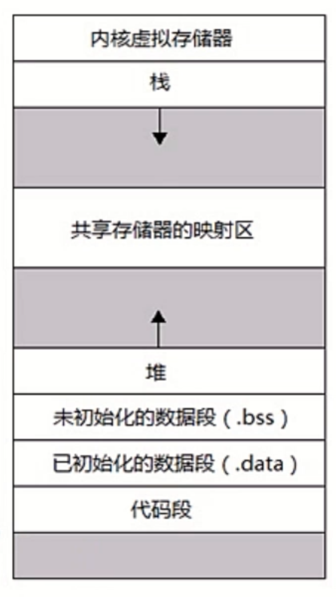
**共享存储器映射区：存储一些库函数。**
## 内核如何处理系统调用
* 每个系统调用都被赋予一个系统调用号；
* 在`i386`平台上，执行一个系统调用是通过`int 0x80`实现的；
* `eax`寄存器存放系统调用号；
* `ebx、ecx、edx、esi、edi`寄存器存储系统调用参数，对于超过`5`个参数的系统调用，用一个寄存器指向用户空间存储所有系统调用的缓存。

## 错误处理
在系统编程中的错误通常通过函数返回值表示，并通过特殊变量`errno`来描述。
`errno`这个全局变量在`errno.h`的头文件中声明，声明为`extern int errno`。
错误处理函数：
* `perror`
* `strerror`

常见错误码：

|  错误码   |         描述         |
| :-------: | :------------------: |
|  `E2BIG`  |     参数列表太长     |
| `EACCESS` |       权限不足       |
| `EAGAIN`  |         重试         |
|  `EBADF`  |   错误的文件描述符   |
|  `EBUSY`  |     设备或资源忙     |
| `ECHILD`  |       无子进程       |
|  `EDOM`   | 数学参数不在函数域内 |
| `EEXIST`  |      文件已存在      |
| `EFAULT`  |       地址错误       |
|  `EFBIG`  |       文件太大       |
|  `EINTR`  |    系统调用被中断    |

## 文件与`I/O`
`I/O`的高级与低级区分主要是通过：是否存在缓冲。
文件描述符与文件指针的转换：
> `fileno`将文件指针转换为文件描述符。
> `fdopen`将文件描述符转换为文件指针。

```cpp
#include <stdio.h>
#include <stdlib.h>

int main(void) {
  printf("fileno(stdin) = %d\n", fileno(stdin));

  return 0;
}
```
## `open`系统调用
```cpp
/**
 * @brief 打开文件
 *
 * @param path 文件名称，可以包含相对和绝对路径
 * @param flags 文件打开模式
 * @return int 返回值，成功返回文件描述符，否则为-1
 */
int open(const char *path, int flags);
int open(const char *path,int flags, int mode);
```
文件权限：
`rwx`对应数字`111`(二进制)； 权限组分别为：`own,group,other`。
### 关闭文件系统调用
```cpp
/**
 * @brief 关闭文件系统调用
 * 
 * @param fd 打开的文件描述符
 * @return int 关闭成功返回0，失败返回-1
 */
int close(int fd);
```
### `read、write`系统调用
```cpp
#include <sys/types.h>
#include <unistd.h>
/**
 * @brief 从打开的文件描述符中读取字节数
 *
 * @param fd 文件描述符
 * @param buf 指向内存块指针，读取出来的数据存放的位置
 * @param nbytes 从该文件描述符复制到buf的字节个数
 * @return ssize_t 失败返回-1， 文件结束返回0， 正常读取返回读到缓冲区个数
 */
ssize_t read(int fd, void *buf, size_t nbytes);

/**
 * @brief 向打开的fd中写入数据
 *
 * @param fd 文件描述符
 * @param buf 数据所在的缓冲区
 * @param n 要写入的文件个数
 * @return ssize_t 出现错误返回-1，写入成功返回写入到文件的字节数
 */
ssize_t write(int fd, const void *buf, size_t n);
```
实例：
```cpp
/**
 * @file readandwritedemo.cc
 * @author koritafei (koritafei@gmail.com)
 * @brief
 * @version 0.1
 * @date 2021-08-31
 *
 * @copyright Copyright (c) 2021
 *
 */

#include <errno.h>
#include <fcntl.h>
#include <stdio.h>
#include <stdlib.h>
#include <sys/stat.h>
#include <sys/types.h>
#include <unistd.h>

#define ERR_EXIT(m)                                                            \
  do {                                                                         \
    perror(m);                                                                 \
    exit(EXIT_FAILURE);                                                        \
  } while (0)

int main(int argc, char **argv) {

  int infd;
  int outfd;

  if (3 != argc) {
    fprintf(stderr, "Usage %s src dest \n", argv[0]);
    exit(EXIT_FAILURE);
  }

  infd = open(argv[1], O_RDONLY);
  if (-1 == infd) {
    ERR_EXIT("open source error");
  }

  outfd = open(argv[2], O_WRONLY | O_CREAT | O_TRUNC, 0644);
  if (-1 == outfd) {
    ERR_EXIT("open dest error");
  }

  char buf[1024];
  int nread;
  while (0 < (nread = read(infd, buf, 1024))) {
    write(outfd, buf, nread);
  }

  close(infd);
  close(outfd);
  return 0;
}
```
### 文件随机读写
```cpp
#include <cstdio>
#include <unistd.h>
/**
 * @brief 文件的随机读取
 *
 * @param __fd 打开的文件描述符
 * @param __offset 偏移量
 * @param __whence 搜索的起始位置
 * @return off_t 新的文件偏移值
 */
off_t lseek(int __fd, __off_t __offset, int __whence);
```
### 文件`stat`
```cpp
struct stat{
  dev_t st_dev; // 设备号
  ino_t st_ino; // inode 
  mode_t st_mode; // 权限
  nlink_t st_nlink; // 硬链接数
  uid_t st_uid; // 所有者ID
  gid_t st_gid;  // 所有者group
  dev_t st_rdev; // 设备号
  off_t st_size; // 字节数
  blksize_t st_blksize; // 系统文件块
  blkcnt_t st_blocks; // 512B文件簇个数
  time_t st_atime; // 文件最后访问时间
  time_t st_mtime; // 文件最后修改时间
  time_t st_ctime; // 文件状态最后修改时间
};
```
### 文件共享
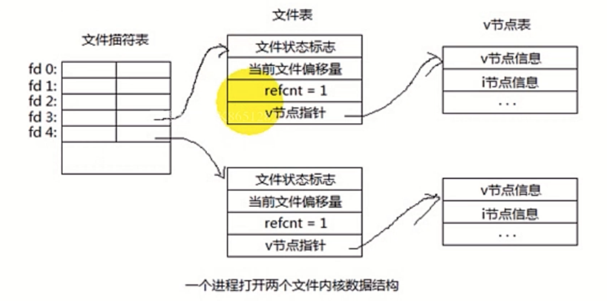
每个进程都包含一个文件描述符表。
`0,1,2`被默认占用的。
进程打开文件`fd`计数从3开始。
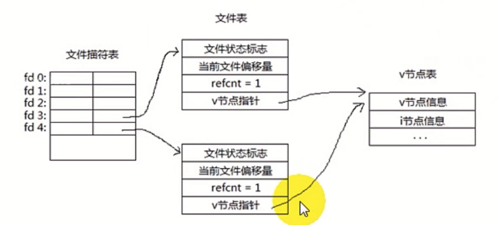
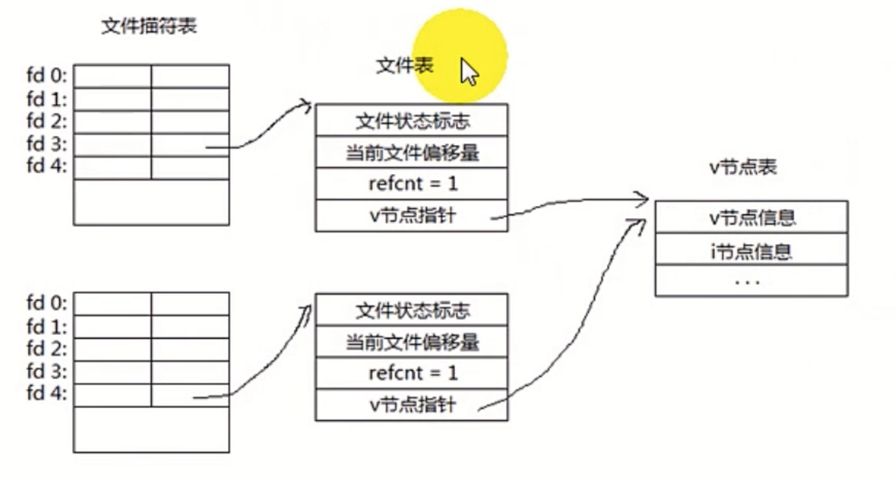
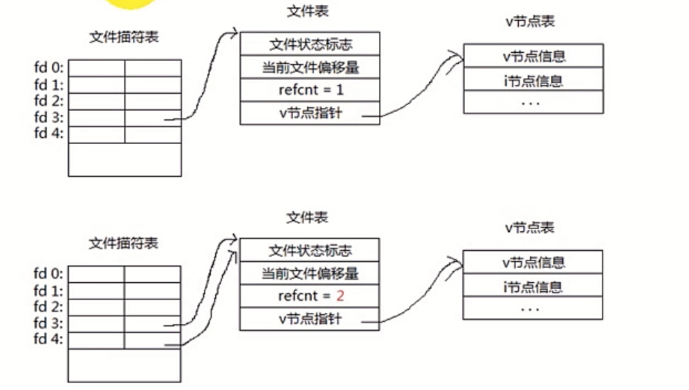

### 文件锁
```cpp
struct flock{
  ...
  short l_type; // 锁的类型
  short l_wheel; // 锁的范围
  off_t l_start; 
  off_t l_len; // 锁定的字节数
  pid_t l_pid;
};
```
```cpp
#include <cstdlib>
#include <cstring>
#include <fcntl.h>
#include <stdio.h>

#define ERR_EXIT(m)                                                            \
  do {                                                                         \
    perror(m);                                                                 \
    exit(EXIT_FAILURE);                                                        \
  } while (0)

int main(int argc, char **argv) {
  int fd;
  fd = open(argv[1], O_RDONLY);
  if (-1 == fd) {
    ERR_EXIT("open fail");
  }

  struct flock lock;
  memset(&lock, 0, sizeof(lock));

  lock.l_type = F_WRLCK;
  lock.l_whence = SEEK_SET;
  lock.l_start = 0;
  lock.l_len = 0;

  if (0 == fcntl(fd, F_SETLK, &lock)) {
    printf("lock sucess!");
    printf("press any key to unlock");
    lock.l_type = F_UNLCK;
    if (0 == fcntl(fd, F_SETLK, &lock)) {
      printf("unlock sucess!\n");
    } else {
      ERR_EXIT("unlock");
    }
  } else {
    ERR_EXIT("lock fail");
  }

  return 0;
}
```
### 进程
> 1. 程序的一次执行过程；
> 2. 操作系统资源分配的最小单位；
> 3. 每个进程都有自己独立的地址空间与执行状态。

未初始化的数据段，只保留了相关符号，没有空间。

进程与程序的区别：
|         进程         |         程序         |
| :------------------: | :------------------: |
|        动态的        |        静态的        |
|   生命周期相对短暂   |        永久的        |
|  含有数据结构`PCB`   |         ---          |
| 一个进程对应一个程序 | 一个程序对应多个进程 |

#### 进程状态机
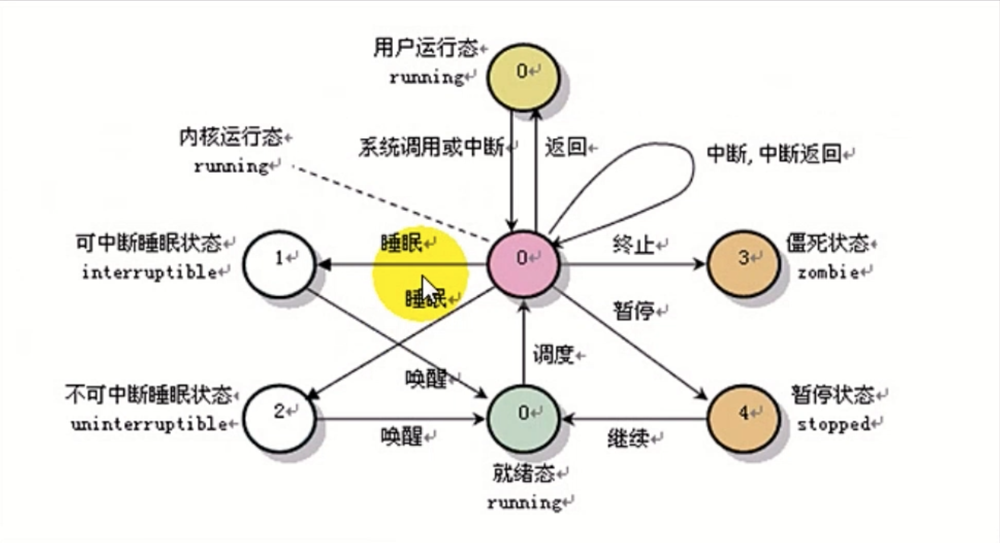
#### `fork`复制一个进程镜像
子进程从父进程继承整个地址空间，包括以下数据：
> 1. 进程上下文；
> 2. 进程堆栈；
> 3. 内存信息；
> 4. 打开的文件描述符；
> 5. 信号控制设置；
> 6. 进程优先级；
> 7. 进程信号组；
> 8. 当前工作目录；
> 9. 根目录；
> 10. 资源限制；
> 11. 控制终端等。

父子进程的区别：
> 1. 父进程设置的锁，子进程不继承；
> 2. 各自的进程`ID`与父进程不同；
> 3. 子进程的未决警告被清除；
> 4. 子进程的未决信号集设置为空。

```cpp
/**
 * @brief 创建一个子进程
 *
 * @return pid_t 成功创建一个子进程，对父进程来说返回子进程ID，对子进程来说返回0，失败返回-1
 */
pid_t fork();
```
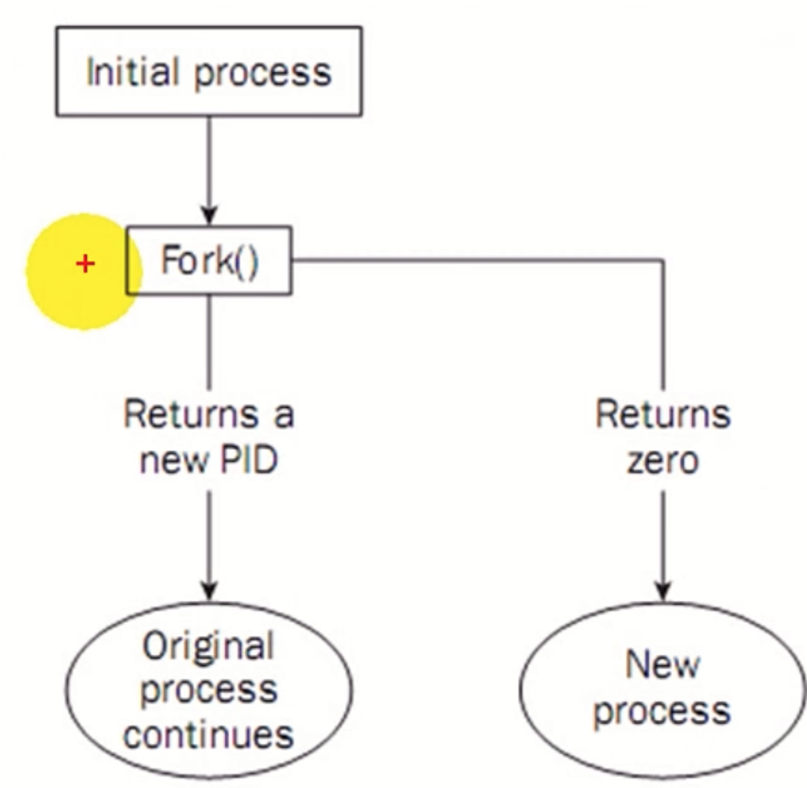
```cpp
#include <errno.h>
#include <stdio.h>
#include <stdlib.h>
#include <sys/types.h>
#include <unistd.h>

#define ERR_EXIT(m)                                                            \
  do {                                                                         \
    perror(m);                                                                 \
    exit(EXIT_FAILURE);                                                        \
  } while (0)

int main(int argc, char **argv) {
  printf("main process pid = %d\n", getpid());
  pid_t pid = fork();
  if (-1 == pid) {
    ERR_EXIT("fork");
  }

  if (0 < pid) {
    printf("this is parent process pid = %d\n", getpid());
  } else if (0 == pid) {
    printf("this is child process pid = %d\n", getpid());
  }

  return 0;
}
```
**注意：**
1. `fork`系统调用之后，父子进程交替运行；
2. 如果父进程先退出，子进程未退出，那么子进程的父进程变为`init`进程；
3. 如果子进程先退出，父进程后退出，那么子进程必须等待父进程捕捉了子进程的退出状态在推出，否则子进程变为僵死进程。

##### 写时复制(`copy on write`)
1. 如果多个进程要读取他们自己的那部分资源副本，那么复制是不必要的；
2. 每个进程只要保存指向这个资源的指针就可以；
3. 如果一个进程需要修改自己的资源副本，就会复制那份资源，即写时复制。

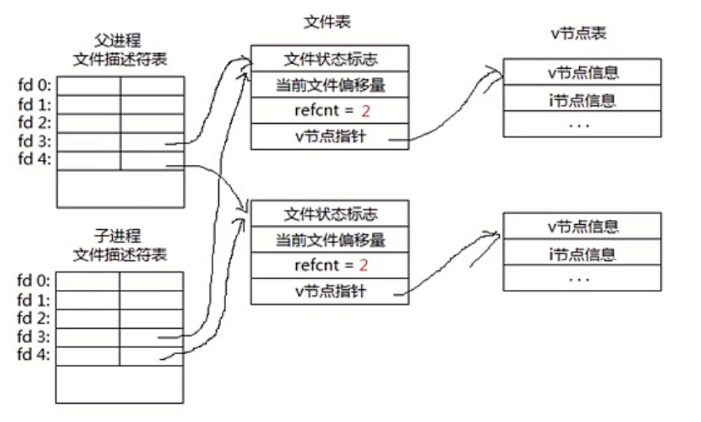
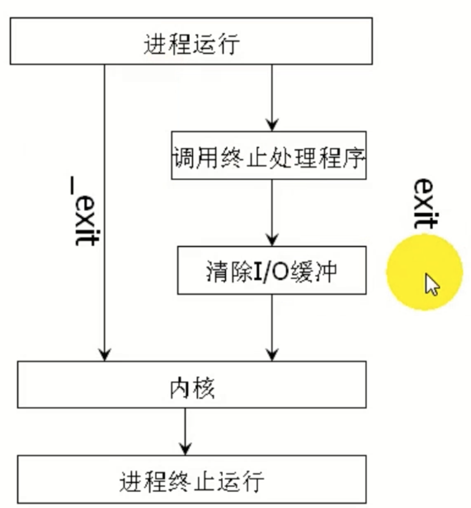

|         `exit`         |         `_exit`          |
| :--------------------: | :----------------------: |
|       `C`库函数        |         系统调用         |
|   调用缓冲区清空处理   |       不处理缓冲区       |
| 调用注册的终止处理程序 | 不调用注册的终止处理程序 |

`execve`函数可以用来替换进程镜像。

#### `SIGCHLD`信号
* 当子进程退出时，内核向父进程发送`SIGCHLD`信号，子进程退出是异步事件(可以在任何时刻退出)；
* 子进程退出时，内核将子进程状态标记为僵尸状态，这时成为僵尸进程，只保留了一些最少的内核数据结构，方便父进程查询子进程的退出状态。
* 父进程查询子进程的退出状态可以使用`wait/waitpid`函数。
```cpp
#include <errno.h>
#include <fcntl.h>
#include <stdio.h>
#include <stdlib.h>
#include <sys/types.h>
#include <sys/wait.h>
#include <unistd.h>

#define ERR_EXIT(m)                                                            \
  do {                                                                         \
    perror(m);                                                                 \
    exit(EXIT_FAILURE);                                                        \
  } while (0)

int main(int argc, char **argv) {
  printf("main process pid = %d\n", getpid());
  pid_t pid = fork();
  if (-1 == pid) {
    ERR_EXIT("fork");
  }

  if (0 < pid) {
    printf("this is parent process pid = %d , child pid = %d\n", getpid(), pid);
    int status;
    pid_t p = wait(&status);
    printf("child process exit pid=%d, status = %d\n", p, status);
  } else if (0 == pid) {
    sleep(3);
    printf("this is child process pid = %d\n", getpid());
    exit(100);
  }

  // int status;
  // pid_t p = wait(&status);
  // printf("child process exit pid=%d, status = %d\n", p, status);

  return 0;
}
```
`WIFEXITED`函数可以检测子进程是否正常退出。
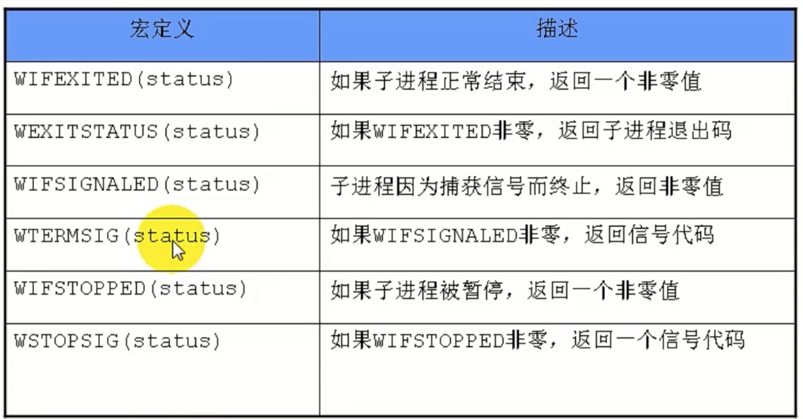
#### 守护进程
守护进程不受终端控制，系统运行时自动启动。名称常以`d`结尾，如：`sshd`等。
#### 守护进程创建步骤
1. 调用`fork()`创建进程，它会是将来的守护进程；
2. 在父进程中调用`exit()`函数，保证子进程不是进程组组长；
3. 调用`setsid`创建新的会话期；
4. 将当前目录改为根目录；
5. 将标准输入，标准输出，错误输出改到`/dev/null`。

```cpp
/**
 * @file daemondemo.cc
 * @author koritafei (koritafei@gmail.com)
 * @brief
 * @version 0.1
 * @date 2021-09-01
 *
 * @copyright Copyright (c) 2021
 *
 */

#include <errno.h>
#include <fcntl.h>
#include <stdio.h>
#include <stdlib.h>
#include <string.h>
#include <sys/stat.h>
#include <sys/types.h>
#include <unistd.h>

#define ERR_EXIT(m)                                                            \
  do {                                                                         \
    perror(m);                                                                 \
    exit(EXIT_FAILURE);                                                        \
  } while (0)

int setup_daemon() {
  pid_t pid = fork();
  if (-1 == pid) {
    ERR_EXIT("fork");
  }

  if (0 > pid) {
    exit(0); // 父进程退出
  }

  setsid(); // 创建新的会话期

  chdir("/"); // 切换主目录

  for (int i = 0; i < 3; i++) {
    close(i); // 关闭标准输入
  }

  open("/dev/null", O_RDWR);
  dup(0);
  dup(0);

  return 0;
}

int main(int argc, char **argv) {
  setup_daemon();
  while (1) {
  }
  return 0;
}
```
### 信号
中断是系统对异步事件做出来的响应。
中断处理流程：
中断源 => 中断屏蔽 => 保护现场 => 中断处理程序 => 恢复现场

信号与中断的相似点：
1. 采用了相同的异步通信方式；
2. 当检测到有信号或中断时，都暂停当前正在执行的程序转而去执行相应的处理程序；
3. 都在处理完毕之后返回原来的断点；
4. 对信号或中断都可以屏蔽。

信号与中断的区别：
1. 中断有优先级，信号没有优先级，所有的信号都是平等的；
2. 信号处理程序是在用户态，中断处理程序是在核心态；
3. 中断响应是及时的，信号响应非及时的。

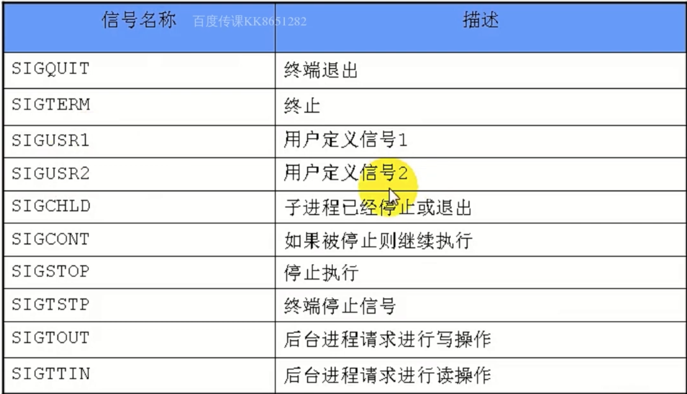
不可被忽略的信号：`SIGKILL和SIGSTOP`。
```cpp
typedef void (*__sighandler_t)(int);
#define SIG_ERR ((__sighandler_t)-1)
#define SIG_DFL((__sighandler_t)0) // 恢复默认行为
#define SIG_IGN((__sighandler_t)1) // 屏蔽该信号

/**
 * @brief 注册信号
 *
 * @param signum 需要捕捉的信号
 * @param handler 捕捉到信号调用的操作
 * @return __sighandler_t
 */
__sighandler_t signal(int signum, __sighandler_t handler);
```
```cpp
/**
 * @file signaldemo.cc
 * @author koritafei (koritafei@gmail.com)
 * @brief
 * @version 0.1
 * @date 2021-09-01
 *
 * @copyright Copyright (c) 2021
 *
 */

#include <errno.h>
#include <fcntl.h>
#include <signal.h>
#include <stdio.h>
#include <stdlib.h>
#include <string.h>
#include <unistd.h>

void handler(int sig) { printf("recv a sig = %d\n", sig); }

int main(int argc, char **argv) {
  signal(SIGINT, handler);
  for (;;)
    ;
  return 0;
}
```
`kill`系统调用：
```cpp
#include <signal.h>
#include <sys/types.h>
/**
 * @brief 向进程发送9信号
 *
 * @param pid
 *        pid > 0 信号发送给进程号=pid的进程
 *        pid = 0 信号发送给调用者进程所在组中的每一个进程
 *        pid = -1 信号发送给调用者进程能够发送的每一个进程，除了1号进程与其自身
 *        pid < -1 信号发送给进程组=-pid的每一个进程
 * @param sig
 * @return int
 */
int kill(pid_t pid, int sig);
```
```cpp
/**
 * @file killdemo.cc
 * @author koritafei (koritafei@gmail.com)
 * @brief
 * @version 0.1
 * @date 2021-09-01
 *
 * @copyright Copyright (c) 2021
 *
 */

#include <csignal>
#include <errno.h>
#include <fcntl.h>
#include <signal.h>
#include <stdio.h>
#include <stdlib.h>
#include <string.h>
#include <unistd.h>

#define ERR_EXIT(m)                                                            \
  do {                                                                         \
    perror(m);                                                                 \
    exit(EXIT_FAILURE);                                                        \
  } while (0)

void handler(int sig) { printf("recv a sig = %d\n", sig); }

int main(int argc, char **argv) {
  signal(SIGUSR1, handler);
  pid_t pid = fork();

  if (-1 == pid) {
    ERR_EXIT("fork");
  }

  if (0 == pid) {
    pid = getpgrp();
    kill(-pid, SIGUSR1);
    exit(EXIT_SUCCESS);
  }

  int n = 5;
  do {
    sleep(n);
  } while (n--);

  return 0;
}
```
`raise`等价于给自己发信号,`raise(sig) == kill(getpid(), sig)`
`killpg`向组发信号，`killpg(pgrp, sig) == kill(-pgrp, sig)`
`sigqueue`向进程发送信号，支持排队，可以附带信息。
### 可重入函数
一个可以被多个任务调用的过程，任务在调用时不必担心数据是否会出错。
满足下列条件的函数一般是不可再入的：
1. 使用静态数据结构,`如getlogin(), gmtime()等`;
2. 函数实现时，调用了`malloc()和free()`函数;
3. 实现时使用了标准`I/O`函数。

### 信号在内核中的表示
执行信号的处理动作成为信号递达(`Delivery`);
从信号产生到信号递达之间的状态称为信号未决(`Pending`);
被阻塞的信号产生时将保持在未决状态，直到进程解除阻塞。
```cpp
#include <signal.h>

/**
 * @brief 改变进程接收到特定信号的行为
 *
 * @param __sig 信号值，除SIGKILL,SIGSTOP之外的所有值
 * @param __act 指向sigaction结构体，在sigaction结构体实例中指定了对象的处理
 * @param __oact 指向的对象保存原来对相应信号的处理，
 * @return int 成功为0， 失败为-1
 */
int sigaction(int __sig,
              const struct sigaction *__restrict __act,
              struct sigaction *__restrict __oact);
```
`sigaction`实例：
```cpp
/**
 * @file signalactiondemo.cc
 * @author koritafei (koritafei@gmail.com)
 * @brief
 * @version 0.1
 * @date 2021-09-01
 *
 * @copyright Copyright (c) 2021
 *
 */
#include <bits/types/sigset_t.h>
#include <errno.h>
#include <fcntl.h>
#include <signal.h>
#include <stdio.h>
#include <stdlib.h>
#include <string.h>
#include <unistd.h>

#include <csignal>

#define ERR_EXIT(m)                                                            \
  do {                                                                         \
    perror(m);                                                                 \
    exit(EXIT_FAILURE);                                                        \
  } while (0)

void handler(int sig) {
  printf("recv sig = %d\n", sig);
  sleep(4);
}

int main(int argc, char **argv) {
  struct sigaction act;

  act.sa_handler = handler;
  sigemptyset(&act.sa_mask);
  act.sa_flags = 0;
  // sigaddset(&act.sa_mask, SIGQUIT);

  sigset_t s;
  sigemptyset(&s);
  sigaddset(&s, SIGINT);
  sigprocmask(SIG_BLOCK, &s, NULL);

  if (0 > sigaction(SIGINT, &act, NULL)) {
    ERR_EXIT("signal action");
  }

  for (;;) {
    pause();
  }

  return 0;
}
```
`sigqueue`系统调用：
```cpp
#include <csignal>
/**
 * @brief 支持信号带参数，与sigaction配合使用
 *
 * @param __pid 接收信号的pid
 * @param __sig 需要发送的信号
 * @param __val 联合数据结构union sigval,指定了信号传递参数，4字节值
 * @return int 成功返回0，失败返回-1
 */
int sigqueue(__pid_t __pid, int __sig, const union sigval __val);
```
联合体数据结构：
```cpp
union sigval{
  int sig_int;
  void *sival_ptr;
};
```
三种时间格式：
```cpp
time_t // 秒

struct timeval{
  long tv_sec; // 秒
  long tv_usec; // 毫秒
};

struct timespec{
  time_t tv_sec; // 秒
  long tv_nsec;// 纳秒
};
```
定时函数：
```cpp
#include <sys/time.h>

/**
 * @brief 定时产生时钟(SIGARLAM)信号
 *
 * @param __which 信号设置宏
 * @param __new 设置时间
 * @param __old 原来关联值
 * @return int
 */
int setitimer(__itimer_which_t __which,
              const struct itimerval *__restrict __new,
              struct itimerval *__restrict __old);

/**
 * @brief 获取当前时钟剩余时间
 *
 * @param __which
 * @param __value
 * @return int
 */
int getitimer(__itimer_which_t __which, struct itimerval *__value);
```
`settimer`的三种信号宏：

|      宏定义      |                                                                         描述                                                                         |
| :--------------: | :--------------------------------------------------------------------------------------------------------------------------------------------------: |
|  `ITIMER_REAL`   |                                                      指定时间后，内核发送`SIGALRM`信号到本进程                                                       |
| `ITIMER_VIRTUAL` |                                           程序在用户空间执行指定时间后，内核将发送`SIGVTALRM`信号到本进程                                            |
|   `ITIMER_ROF`   | 进程在内核空间执行的时候，时间计数器会减少，通常与`ITIMER_VIRTUAL`搭配使用，代表程序在内核空间与用户空间运行指定时间后，内核会发送`SIGPROF` 到本进程 |

```cpp
/**
 * @file timerdemo.cc
 * @author koritafei (koritafei@gmail.com)
 * @brief
 * @version 0.1
 * @date 2021-09-02
 *
 * @copyright Copyright (c) 2021
 *
 */

/**
 * @file signaldemo.cc
 * @author koritafei (koritafei@gmail.com)
 * @brief
 * @version 0.1
 * @date 2021-09-01
 *
 * @copyright Copyright (c) 2021
 *
 */

#include <errno.h>
#include <fcntl.h>
#include <signal.h>
#include <stdio.h>
#include <stdlib.h>
#include <string.h>
#include <sys/time.h>
#include <unistd.h>

#define ERR_EXIT(m)                                                            \
  do {                                                                         \
    perror(m);                                                                 \
    exit(EXIT_FAILURE);                                                        \
  } while (0)

void handler(int sig) {
  printf("recv a sig = %d\n", sig);
}

int main(int argc, char **argv) {
  if (SIG_ERR == signal(SIGALRM, handler)) {
    ERR_EXIT("signal");
  }

  struct timeval tv_interval = {1, 0};  // 第一次之后间隔时间
  struct timeval tv_val      = {1, 0};  // 第一次间隔时间

  struct itimerval it;
  it.it_interval = tv_interval;
  it.it_value    = tv_val;

  setitimer(ITIMER_REAL, &it, NULL);

  for (int i = 0; i < 1;) {
  }

  struct itimerval oit;
  // setitimer(ITIMER_REAL, &it, &oit);
  getitimer(ITIMER_REAL, &oit);
  printf("%d\t%d\t%d\t%d\n",
         oit.it_interval.tv_sec,
         oit.it_interval.tv_usec,
         oit.it_value.tv_sec,
         oit.it_value.tv_usec);
  return 0;
}
```
### 管道
`UNIX`下进程通信的古老方式。
一个进程连接到另一个进程的数据流。
可以视为有固定大小的内核缓冲区。
特点：
1. 半双工的，数据只能向一个方向流动，需要双方通信要两个管道；
2. 只能用于有共同祖先的进程，通常进程首先创建管道，再次创建子进程，之后利用管道实现父子进程通信。

```cpp
#include <unistd.h>
/**
 * @brief 创建管道
 *
 * @param __pipedes 文件描述符组，fd[0]--读端， fd[1]--写端
 * @return int 成功返回0， 失败返回错误码
 */
int pipe(int *__pipedes);
```
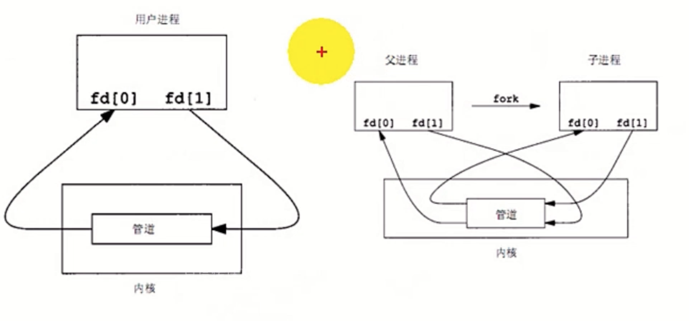
```cpp
/**
 * @file lswcdemo.cc
 * @author koritafei (koritafei@gmail.com)
 * @brief
 * @version 0.1
 * @date 2021-09-02
 *
 * @copyright Copyright (c) 2021
 *
 */

#include <errno.h>
#include <fcntl.h>
#include <signal.h>
#include <stdio.h>
#include <stdlib.h>
#include <string.h>
#include <unistd.h>

#include <csignal>
#include <cstdlib>

#define ERR_EXIT(m)                                                            \
  do {                                                                         \
    perror(m);                                                                 \
    exit(EXIT_FAILURE);                                                        \
  } while (0)

int main(int argc, char **argv) {
  int pipefd[2];
  if (-1 == pipe(pipefd)) {
    ERR_EXIT("pipe");
  }

  pid_t pid = fork();
  if (-1 == pid) {
    ERR_EXIT("fork");
  }

  if (0 == pid) {
    dup2(pipefd[1], STDOUT_FILENO);
    close(pipefd[0]);
    close(pipefd[1]);
    execlp("ls", "ls", NULL);
    fprintf(stderr, "execlp excute error");
    exit(EXIT_FAILURE);
  }

  dup2(pipefd[0], STDIN_FILENO);
  close(pipefd[0]);
  close(pipefd[1]);
  execlp("wc", "wc", "-w", NULL);
  fprintf(stderr, "execlp excute error");
  exit(EXIT_FAILURE);

  return 0;
}
```
#### 管道读写规则
1. 无数据时
   > * `O_NONBLOCK disable`: `read`调用阻塞，即进程暂停执行，直到等到数据到来；
   > * `O_NONBLOCK enable`: `read`调用返回`-1`, `errno`的值为`EAGAIN`.

2. 如果所有管道写端对应的文件描述符被关闭，`read`返回`0`;
3. 如果所有管道读端对应的文件描述符被关闭，`write`返回`SIGPIPE`信号; 
4. 当写入数据不大于`PIPE_BUF`时，`linux`保证写入数据的原子性；
5. 当写入数据大于`PIPE_BUF`时，`linux`不保证写入数据的原子性。

命名文件：特殊类型的文件。
```cpp
/**
 * @brief 创建命名管道
 *
 * @param __path 文件目录
 * @param __mode 文件权限
 * @return int
 */
int mkfifo(const char *__path, __mode_t __mode);
```

